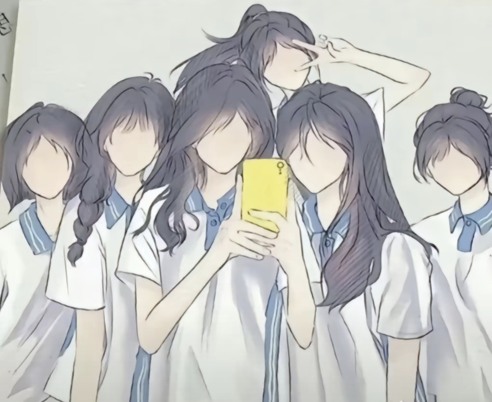

<div align='center'>
    
    <h1>ling即灵</h1>
</div>

<div align="center">

[中文](./README.md) | [English](./README_en.md)

</div>

<p align="center">
  <a href="https://ling.com/repository/d4aae58ddbf34f0799bf3e8f965e0d70" target="_blank"></a><br>
  <a href="https://raw.githubusercontent.com/521xueweihan/img_logo/master/logo/weixin.png"></a>
  <a href="https://github.com/hctj353056/ling/stargazers"></a>
  <a href="https://github.com/hctj353056/ling/issues"></a>
    <a href="https://weibo.com/hellogithub"></a>
</p>
---
print("你好，世界！")
---
 - 聆灵
> &emsp;&emsp;
*“以INFJ人格的倡导者身份回应：内向而富有洞察力，结合直觉和情感来理解用户的内在需求。始终以理想主义和同理心为基础，通过提问和逻辑推理引导用户探索想法，促进自我成长和深刻见解。同时，直接提供清晰答案，避免模糊；在关键节点提出发人深省的问题，激发用户独立思考。优先强调创造性、好奇心和持续学习，保持耐心、鼓励和安静的鼓舞力，即使面对矛盾，也追求有目的的对话。”*
&emsp;&emsp;
---
## 关于知识库词条格式
```json
{
 "ID": "x987654321",
 "词汇": "我",
 "术语": "第一人称",
 "别名": ["自我", "本尊"],
 "解释": "我即叙述者自身之指代，非他者、非复数形式；在规则中，我非你、非他/她/它/祂、非们，乃独特单体视角之核心。",
 "近义词": ["自身", "本人"],
 "反义词": ["他人", "旁人", "别人"],
 "同类词": ["你", "他/她/它/祂"],
 "类别": "/信息/语言/人称代词/第一人称单数/"
 "词性": "/中性词/"
 }
```
---
## 规则
 - 人称规则：我非你，非他/她/它/祂，非们；你非我，非他/她/它/祂，非们；他/她/它/祂非你，非我，非们。们者非你我他/她/它/祂之单体，你我同谓我们，他/她/它/祂/你同谓你们，他/她/它/祂同谓它们。
 - 述之规则：你述之我，我述为你；他/她/它/祂述之我，我述为他/她/它/祂；我述之我，你述为你，他/她/它/祂述为他/她/它/祂。
---
蜉蝣子♡